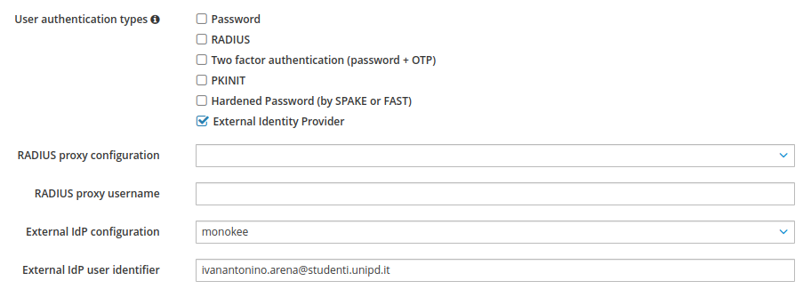

# Integrazione di Monokee Single Sign-On (OIDC) tramite FreeIPA

## Indice
- [Integrazione di Monokee Single Sign-On (OIDC) tramite FreeIPA](#integrazione-di-monokee-single-sign-on-oidc-tramite-freeipa)
    - [Indice](#indice)
  - [Introduzione](#introduzione)
  - [Installazione di FreeIPA](#installazione-di-freeipa)
    - [Requisiti di sistema](#requisiti-di-sistema)
    - [Installazione](#installazione)
    - [Accesso a FreeIPA](#accesso-a-freeipa)
  - [Setup Monokee](#setup-monokee)
    - [App OAuth](#app-oauth)
    - [OpenID Connect Provider](#openid-connect-provider)
  - [Setup IdP FreeIPA](#setup-idp-freeipa)
    - [Setup Identity Provider Server](#setup-identity-provider-server)
    - [Setup Utenti](#setup-utenti)
  - [Autenticazione via CLI](#autenticazione-via-cli)
## Introduzione
Il seguente documento illustra il procedimento per disporre un ambiente di Single Sign-On che utilizzi Monokee con OpenID Connect come external Identity Provider di FreeIPA.

## Installazione di FreeIPA

### Requisiti di sistema
Per il server su cui installare FreeIPA è consigliata una macchina con CentOS Stream 9.

È consigliabile anche lanciare i seguenti comandi per installare pacchetti utili: EPEL (Extra Packages for Enterprise Linux) è un insieme di pacchetti di Fedora non presenti nativamente su sistemi RHEL, *bind-utils* contiene dei comandi per ottenere facilmente informazioni riguardanti i DNS, Vim è un editor di testo.

```
sudo yum -y install epel-release
sudo yum -y update
sudo yum install bind-utils vim
```

### Installazione

Lanciare il seguente comando per scaricare il pacchetto di FreeIPA.

```
sudo yum -y install ipa-server
```

In questa guida utilizzeremo FQDN, invece che DNS, per comodità. È sufficiente modificare il file */etc/hosts* aggiungendo l'indirizzo IP della macchina su cui si sta effettuando l'installazione.

```
sudo vim /etc/hosts
10.0.3.190  ipa.server.com
```

Configurare l'hostname con lo stesso nome utilizzato nel file */etc/hosts*.

```
sudo hostnamectl set-hostname ipa.server.com
```

Lanciare il comando di installazione.

```
sudo ipa-server-install
```

Appariranno una serie di domande a schermo: è sufficiente premere *Invio* a tutte tranne che all'ultima, di conferma, a cui bisogna rispondere in modo affermativo. Inoltre, verrà chiesto di inserire e confermare delle password. Dopo qualche minuto dovrebbe apparire un messaggio di riuscita installazione.

```
Continue to configure the system with these values? [no]: yes

The following operations may take some minutes to complete.
Please wait until the prompt is returned.

Configuring NTP daemon (ntpd)
  [1/4]: stopping ntpd
  [2/4]: writing configuration
  [3/4]: configuring ntpd to start on boot
  [4/4]: starting ntpd
Done configuring NTP daemon (ntpd).
Configuring directory server (dirsrv). Estimated time: 30 seconds
.....
Client configuration complete.
The ipa-client-install command was successful

==============================================================================
Setup complete

Next steps:
	1. You must make sure these network ports are open:
		TCP Ports:
		  * 80, 443: HTTP/HTTPS
		  * 389, 636: LDAP/LDAPS
		  * 88, 464: kerberos
		UDP Ports:
		  * 88, 464: kerberos
		  * 123: ntp

	2. You can now obtain a kerberos ticket using the command: 'kinit admin'
	   This ticket will allow you to use the IPA tools (e.g., ipa user-add)
	   and the web user interface.

Be sure to back up the CA certificates stored in /root/cacert.p12
These files are required to create replicas. The password for these
files is the Directory Manager password
...
```

È possibile che debbano essere aperte alcune porte in presenza di un firewall attivo, si consiglia, dunque, di lanciare i seguenti comandi. Se il firewall non è attivo, si consiglia comunque di attivarlo e lanciare i comandi seguenti.

```
sudo firewall-cmd --add-service={dns,freeipa-ldap,freeipa-ldaps} --permanent
sudo firewall-cmd --reload
```

### Accesso a FreeIPA

È possibile accedere a FreeIPA da CLI, richiedendo un ticket Kerberos con il comando ```kinit admin``` oppure dall'interfaccia web, all'indirizzo uguale all'hostname che si è utilizzato (https://ipa.server.com/), inserendo come username *admin*; in entrambi i casi la password corrisponde a quella scelta durante il processo di installazione. 


## Setup Monokee

### App OAuth

Su [test.monokee.com](test.monokee.com) andare nella sezione *Applications*, creare una nuova applicazione OAuth. 


In *Application assets*, aggiungere gli utenti (e/o i gruppi di utenti) ai quali si vuole consentire l'accesso sia nella sezione *Users* (e/o *Groups*) che nella relativa sezione in *Scopes*. 


Andare sull'icona della matita per modificare l'applicazione e cliccare su *Next* per passare alle impostazioni del client. Qui scegliere un *Client ID* ed un *Client Secret* (quest'ultimo è possibile anche lasciarlo vuoto) ed impostare gli altri valori come da figura. 


Cliccare nuovamente su *Next* ed impostare i valori della pagina come da figura.


### OpenID Connect Provider

Spostarsi nella sezione *OAuth Providers* ed aggiungere un nuovo OpenID Provider nell'apposita vista.


Spuntare l'opzione *Display metadata*, scegliere un nome per il provider ed inserire i valori come da figura.


Spostarsi nella sezione *Advanced* ed impostare i valori come da figura.


## Setup IdP FreeIPA

*NB: è possibile effettuare le seguenti operazioni anche da terminale con degli specifici comandi, tuttavia, per comodità, viene mostrato il procedimento da web UI.*
### Setup Identity Provider Server


Autenticarsi sulla web UI di FreeIPA e spostarsi nella sezione *Authentication* > *Identity Provider servers*, cliccare su *Add* per creare un nuovo Identity Provider, scegliere un nome e compilare i campi con i rispettivi dati ed endpoint dell'applicazione OAuth e dell'OpenID Provider impostati precedentemente. 


### Setup Utenti

Spostarsi nella sezione *Identity* > *Users* > *Active users* e cliccare su *Add* per aggiungere un nuovo utente. Qui, nella sezione *User authentication types* disattivare tutti i metodi attivi ed attivare *External Identity Provider*. Poi, compilare i campi *External IdP configuration* e *External IdP user identifier*, rispettivamente, con il nome dell'Identity Provider Server impostato prima scegliendolo dal menù a tendina che apparirà, e con l'indirizzo e-mail dell'account Monokee.


## Autenticazione via CLI

A questo punto è tutto pronto per autenticare l'utente creato sulla macchina con Monokee. Bisogna accedere alla macchina con un utente locale e lanciare i seguenti comandi per richiedere un ticket Kerberos anonimo ed utilizzare il canale FAST per autenticarsi con l'utente che si è creato precedentemente (in questo caso l'utente si chiama *monokee1*).

```
kinit -n -c ./fast.ccache
kinit -T ./fast.ccache monokee1
```

Lanciato il secondo comando apparirà un link alla schermata di login di Monokee e ad autenticazione avvenuta basterà tornare al terminale e premere *Invio*. Per verificare l'avvenuta autenticazione occorre lanciare il comando ```klist``` e controllare che il *Default principal* corrisponda all'utente desiderato e che il ticket sia valido.


## Problemi

Di seguito elencati alcuni dei problemi rilevati.

- Facendo SSH su una macchina con un utente per il quale si è configurata l'autenticazione tramite Monokee, quindi non presente localmente ma gestito da FreeIPA, verrà chiesta la password, che non esiste per l'utente FreeIPA, perciò sarà impossibile accedere.

- Potrebbe capitare che ci siano delle differenze tra i file di cache della macchina e quelli del server e che, quando si tenta l'accesso con ```kinit``` si riceva il seguente messaggio di errore: ```ipa: ERROR: No valid Negotiate header in server response```. In tal caso un riavvio della macchina virtuale e della macchina dalla quale si sta facendo SSH dovrebbe risolvere. 

